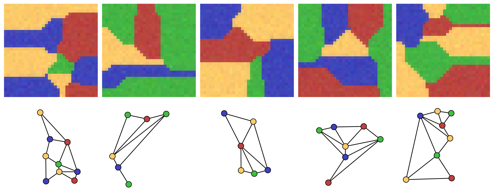

# COLORING

COLORING is a synthetic dataset of image/graph pairs.  Each integer image is a
Voronoi partition whose region adjacency is the target planar graph; adjacent
regions are assigned different color IDs.

- **Top row**: Input image  
- **Bottom row**: Target graph  

<p align="center">
  
</p>

---

Install the dependencies with `python3 -m pip install -r requirements.txt`.

## Generate a dataset

```python
from data_generation import create_coloring_dataset

create_coloring_dataset(
    "data/coloring_10",
    n_samples=100_000,
    n_pixels=32,
    n_nodes_max=10,
    n_nodes_min=4,
    n_colors=4,
    seed=1234,
)
```

This creates one dataset containing memory-mapped `.npy` files:

- `images.npy`: integer array of shape `(n_samples, n_pixels, n_pixels)`;
- `adjacency_matrices.npy`: boolean padded adjacency array of shape
  `(n_samples, n_nodes_max, n_nodes_max)`;
- `node_colors.npy`: integer padded node-color array of shape
  `(n_samples, n_nodes_max)`. Entries after each sample's `n_nodes` value are
  padding and must be ignored;
- `n_nodes.npy`: integer array of shape `(n_samples,)`.
- `summary.json`: generation parameters and array file metadata.

Color arrays use the smallest unsigned dtype that represents their color IDs
(usually `uint8`); `n_nodes.npy` similarly uses the smallest unsigned dtype
that represents `n_nodes_max`.

Generation displays a `tqdm` progress bar as worker processes complete samples.

Load a dataset lazily, including a slice of samples, with:

```python
import numpy as np

images = np.load("data/coloring_10/images.npy", mmap_mode="r")
image_batch = images[1_000:1_032]
```

## Create a WL-aware split

```python
from splitting import create_wl_split

summary = create_wl_split(
    "data/coloring_10",
    "data/coloring_10/folds.csv",
    train_fraction=0.9,
    valid_fraction=0.05,
    test_fraction=0.05,
    n_max_wl_test=10,
    seed=1234,
)
```

`folds.csv` has exactly one `train`, `valid`, or `test` value per sample, in
dataset-index order and without a header.  The splitter starts 1-WL from `node_colors`
and keeps every final WL-equivalence group in one fold.

Pass the same `seed` to repeat dataset generation or split tie-breaking
exactly. Without a generation seed, a fresh random dataset is created; a split
without a seed uses stable dataset-index order for ties.

## Load and visualize samples

```python
from dataset import ColoringDataset
from visualization import plot_graph, plot_image

train_dataset = ColoringDataset(
    "data/coloring_10",
    folds_csv="data/coloring_10/folds.csv",
    fold="train",
)
sample = train_dataset[0]
plot_image(sample.image)
plot_graph(sample.adjacency_matrix, sample.node_colors)
```

`ColoringDataset` is NumPy-only and opens arrays as read-only memory maps. A
sample contains an unpadded `adjacency_matrix` and `node_colors` values; these
together define its graph. It also contains its image, its
original dataset index, and its fold when available.

Both plotting functions leave titles unset by default; pass `title="..."` to
set one. `plot_graph` also accepts `node_positions`, an `(n_nodes, 2)` array;
without it, a Kamada--Kawai layout is computed.

## Reconstruct a graph from an image

```python
from utils import get_graph

graph, adjacency_matrix, node_positions = get_graph(sample.image)
```

`get_graph` separates same-color connected components into nodes, reconstructs
the adjacency matrix from shared pixel boundaries, and estimates normalized
`(x, y)` node positions from component centers. The recovered graph equals the
one encoded by the image up to node permutation.

## Evaluate graphs

```python
from metrics import is_same, is_valid

target_graph = (sample.adjacency_matrix, sample.node_colors)
predicted_graph = (reconstructed_adjacency, reconstructed_graph.node_colors)

is_valid(predicted_graph)             # planar and properly colored
is_same(predicted_graph, target_graph)  # color-preserving isomorphism
```

Both metrics return `0` or `1`. `is_same` applies cheap graph invariants and a
stable labeled 1-WL test before exact planarity and VF2 isomorphism checks. 

## Canonize a graph

```python
from canonization import canonize_graph

canonized_adjacency, canonized_node_colors = canonize_graph(
    (sample.adjacency_matrix, sample.node_colors),
    wl_iterations=3,
)
```

The position-free WL/BFS ordering is adapted from
[GraViti](https://github.com/RomanBresson/GraViti) by Roman Bresson. It reduces
arbitrary node-order variance but, without geometric tie-breakers, unresolved
symmetries fall back to input indices. 

## References

```bibtex
@article{krzakala2024any2graph,
  title={Any2graph: Deep end-to-end supervised graph prediction with an optimal transport loss},
  author={Krzakala, Paul and Yang, Junjie and Flamary, R{\'e}mi and d'Alch{\'e}-Buc, Florence and Laclau, Charlotte and Labeau, Matthieu},
  journal={Advances in Neural Information Processing Systems},
  volume={37},
  pages={101552--101588},
  year={2024}
}

@article{krzakala2025quest,
  title={The quest for the GRAph Level autoEncoder (GRALE)},
  author={Krzakala, Paul and Melo, Gabriel and Laclau, Charlotte and d'Alch{\'e}-Buc, Florence and Flamary, R{\'e}mi},
  journal={arXiv preprint arXiv:2505.22109},
  year={2025}
}
```
